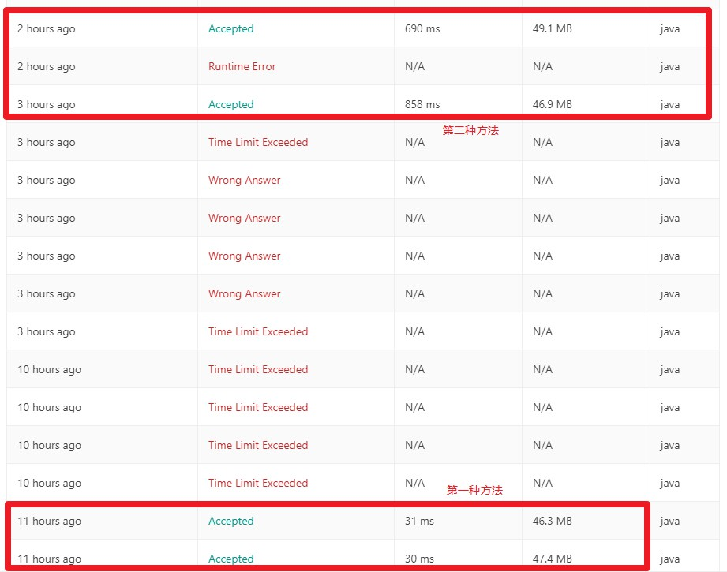

# LeetCode - 题解


## 前言

按照公众号文章[如何全方位的准备数据结构和算法？](https://mp.weixin.qq.com/s/6BuXwpEwCy85jYGKlRpOGA)介绍的策略进行[LeetCode](https://leetcode.com/problemset/algorithms/)的刷题，题解和动图参考引用了[leetcode题解](https://github.com/azl397985856/leetcode)和[LeetCodeAnimation](https://github.com/MisterBooo/LeetCodeAnimation)。

## 1.数组

### 1.[Two Sum](https://leetcode.com/problems/two-sum)

> Given an array of integers, return **indices** of the two numbers such that they add up to a specific target. You may assume that each input would have ***exactly*** one solution, and you may not use the *same* element twice.

**Example：**

> Given nums = [2, 7, 11, 15], target = 9,
>
> Because nums[**0**] + nums[**1**] = 2 + 7 = 9,
> return [**0**, **1**].

**理解和思路：**

1. 如何确定两个数？

   先确定第一个数，这个数必须小于目标数，假设第一个数是 num[i]，然后计算出剩下数的值 number = target - nums[i]，从数组中找到number；如果没有number，说明第一个数无效，再换下一个数，一共需要两次嵌套循环，时间复杂度为：$O(n^2) $。

2. 使用HashMap进行查找

   上述过程使用了两次对数组的遍历，第二次遍历的目的是在数组中对某个特定值number进行搜索，问题变成了一个**查找问题**。使用更加高效的Hash查找，把数组先转换成Map，再进行搜索。

   > 第一步，从下标$i$处开始遍历数组，计算出它对应的组合值：number = target - nums[i]；
   >
   > 第二步，判断map中是否有number，如果有就返回两者的坐标；
   >
   > 第三步，如果没有number，就把当前值nums[i]和下标$i$添加进map中；

   只进行了一次遍历，时间复杂度：$O(n)$。

**代码实现：**

```java
public static int[] twoSum(int[] nums, int target) {
    if (nums == null || nums.length == 0) {
        return null;
    }
    Map<Integer, Integer> map = new HashMap<>();
    int number = 0;
    for (int i = 0; i < nums.length; i++) {
        number = target - nums[i];
        if (map.containsKey(number) && map.get(number) != i) {
            return new int[]{map.get(number), i};
        }
        map.put(nums[i], i);
    }
    return null;
}
```

### 11.[Container With Most Water](https://leetcode.com/problems/container-with-most-water)

> Given *n* non-negative integers *a1*, *a2*, ..., *an* , where each represents a point at coordinate (*i*, *ai*). *n* vertical lines are drawn such that the two endpoints of line *i* is at (*i*, *ai*) and (*i*, 0). Find two lines, which together with x-axis forms a container, such that the container contains the most water.
>
> **Note:** You may not slant the container and *n* is at least 2.


**Example：**

> **Input**: [1,8,6,2,5,4,8,3,7]
> **Output**: 49
>
> **Explanation:** 
>
> The above vertical lines are represented by array [1,8,6,2,5,4,8,3,7]. In this case, the max area of water (blue section) the container can contain is 49.

**理解和思路：**

1. 水的容积与3个变量有关：左边的高、右边的高、两者的下标距离，要求水的容积最大，也就是求两边的高度和X轴组成的矩形面积；
2. 创建两个指针 left 和 right，分表表示左边的坐标和右边的坐标，计算出初始面积：从nums[left] 和 nums[right]中选择出较小值最为 height，面积为 area = height *      (right - left)；
3. $left$从左向右遍历，$right$从右向左遍历，因为两者的距离 (right - left) 在变小，所以只有当遍历到的值大于height时才会停止，计算新的面积，更新最大面积，直到left == right
4. 时间复杂度$O(n)$，空间复杂度$O(1)$。

**代码实现：**

```java
public static int maxArea(int[] nums) {
	int left = 0, right = nums.length - 1;
  int height = Math.min(nums[left], nums[right]);
  int area = (right - left) * height;
  while (left < right) {
  	while (nums[left] <= height && left < nums.length - 1) {
  		left++;
    }
    while (nums[right] <= height && right > 0) {
    	right--;
    }
    height = Math.min(nums[left], nums[right]);
    area = Math.max(area, (right - left) * height);
  }
	return area;
}
```

### 15.[3Sum](https://leetcode.com/problems/3sum)

> Given an array nums of *n* integers, are there elements *a*, *b*, *c* in nums such that *a* + *b* + *c* = 0? Find all unique triplets in the array which gives the sum of zero.
>
> **Note:**The solution set must not contain duplicate triplets.
>
> **Example:**
>
> Given array nums = [-1, 0, 1, 2, -1, -4],
>
> A solution set is:
>  [
>    [-1, 0, 1],
>    [-1, -1, 2]
>  ]

**理解和思路：**

1. 确定3个数满足：A+B+C=0，如果先确定了A，就变成了在剩下的集合中求解：B+C=-A，等价于[第一题](# 1.[Two Sum](https://leetcode.com/problems/two-sum))；
2. 额外要求是，不能出现重复的结果集合，这就要求在确定第一个数A之后，不能出现重复，否则[B，C]的结果集一定会出现重复，为了实现这一目标，需要先把数组排序。
3. 时间复杂度$O(n^2)$

**代码实现：**

```java
public List<List<Integer>> threeSum(int[] nums) {
	List<List<Integer>> result = new ArrayList<>();
	Arrays.sort(nums); // 升序排列

	int target; // 第一个数A的相反数
	int j; // 第二个数B的下标
	int k; // 第三个数C的下标，k从后向前遍历，这样只需要一次遍历就可以完成对剩下所有数据的遍历
	for (int i = 0; i < nums.length; i++) {
		if (i > 0 && nums[i] == nums[i - 1]) {
			continue;
		}
		target = -nums[i];
		j = i + 1;
		k = nums.length - 1;
		while (j < k) {
			if (nums[j] + nums[k] == target) {
				List<Integer> list = new ArrayList<>(3);
				list.add(nums[i]);
				list.add(nums[j]);
				list.add(nums[k]);
				result.add(list);
				j++;
				k--;
				// 为了避免B和C的重复
				while (j < k && nums[j] == nums[j - 1]) {
					j++;
				}
				while (j < k && nums[k] == nums[k + 1]) {
					k--;
				}
			} else if (nums[j] + nums[k] < target) {
				// 因为数组已经排好序了，如果两个数的和小于目标值，就增加j的值
				j++;
			} else {
				// 如果两个数的和大于目标值，就减小K的值
				k--;
			}
		}
	}
	return result;
}
```

**误区：**

在求解这一题时，当时进入了一个误区：竟然数组是有序的，那么在求解第3个数的时候可以使用二分查找，应该比上面那种方法的遍历更加高效，代码如下：

```JAVA
public List<List<Integer>> threeSum(int[] nums) {
	List<List<Integer>> result = new ArrayList<>();
	if (nums == null || nums.length == 0) {
		return result;
	}
	Arrays.sort(nums); // 升序排列

	int target;
	int i; // 第一个数的下标
	int j; // 第二个数B的下标
	int k; // 第三个数C的下标
	for (i = 0; i < nums.length; i++) {
		if (i > 0 && nums[i] == nums[i - 1]) {
			continue;
		}
		j = i + 1;
		while (j < nums.length) {
			int[] subNums = new int[nums.length - j - 1];
			target = -(nums[i] + nums[j]);
			k = binarySearch(nums, j + 1, nums.length, target);
			if (k >j) {
				List<Integer> list = new ArrayList<>(3);
				list.add(nums[i]);
				list.add(nums[j]);
				list.add(nums[k]);
				result.add(list);
			}
			j++;
			while (j < nums.length && nums[j] == nums[j - 1]) {
				j++;
			}
		}
	}
	return result;
}

// 二分查找
private int binarySearch(int[] a, int i, int j, int key) {
	int low = i;
	int high = j - 1;

	while (low <= high) {
		int mid = (low + high) >>> 1;
		int midVal = a[mid];

		if (midVal < key)
			low = mid + 1;
		else if (midVal > key)
			high = mid - 1;
		else
			return mid; // key found
	}
	return -(low + 1);  // key not found.
}
```

提交后发现，结果不如第一种方法，结果对别如下：



后来仔细想了一下才发现原因：方法1在内部循环的时候，可以同时确定2个数B和C，复杂度是$O(n^2)$，而方法2需要先确定B，再使用二分查找确定C，复杂度是$o(n^2*logn)$，所以效率比方法1更低。

### 


<p style="color: rgb(0, 204, 204); text-align: right;">
<a href="#LeetCode - 题解">top⬆</a>
</p>


## 2.Add Two Numbers

You are given two **non-empty** linked lists representing two non-negative integers. The digits are stored in **reverse order** and each of their nodes contain a single digit. Add the two numbers and return it as a linked list.

You may assume the two numbers do not contain any leading zero, except the number 0 itself.

**Example:**

**Input:** (2 -> 4 -> 3) + (5 -> 6 -> 4)
 **Output:** 7 -> 0 -> 8
 **Explanation:** 342 + 465 = 807.

**理解和思路**

1. 链表的第一位值都是个位上的数，所以同时遍历两个链表，把相同位上的值相加；
2. 如果两个数相加有进位，该位置上保存的是和值对10的余数，进位的1则是加到下一个位置上；
3. 创建一个链表，用来保存余值，最后返回该链表的头指针。

**代码**

```java
public ListNode addTwoNumbers(ListNode l1, ListNode l2) {
    if (l1 == null)
        return l2;
    if (l2 == null)
        return l1;
    int current = 0;
    ListNode result = new ListNode(0);
    ListNode pointer = result;

    while (l1 != null || l2 != null || current > 0) {
        if (l1 != null) {
            current += l1.val;
            l1 = l1.next;
        }
        if (l2 != null) {
            current += l2.val;
            l2 = l2.next;
        }
        result.val = current % 10;
        current /= 10;
        if (l1 != null || l2 != null || current > 0) {
            result.next = new ListNode(0);
            result = result.next;
        }
    }
    return pointer;
}
```

<p style="color: rgb(0, 204, 204); text-align: right;">
    <a href="#LeetCode - 题解">top⬆</a>
</p>

------

## 3. Longest Substring Without Repeating Characters

Given a string, find the length of the **longest substring** without repeating characters.

| **Example 1:**                                               | **Example 2:**                                               | **Example   3:**                                             |
| ------------------------------------------------------------ | ------------------------------------------------------------ | ------------------------------------------------------------ |
| **Input:**   "abcabcbb"                                      | **Input:**   "bbbbb"                                         | **Input:**   "pwwkew"                                        |
| **Output:**   3                                              | **Output:**   1                                              | **Output:**   3                                              |
| **Explanation:** The answer is "abc", which the   length is 3. | **Explanation:**   The answer is "b", with   the length of 1. | **Explanation:**   The answer is "wke",   with the length of 3. |

**理解和思路：**

1. 如果字符串的最大无重复字串的下标是：$[i,...,j]$，那么字串的长度是：$j-i+1$，这说明，$[i,...,j]$中某个字符在$[0,...,i-1]$范围内出现过；
2. 假设这个字符是$S_k$，那么该字符同时在两个范围内出现时，就选择下标比较大的那一个，作为无重复字串中的有效字符；
3. 那是不是选择最大的那一个下标呢？不是，而是要选择小于$i$的最大的那一个下标，$i$是当前临时确定的子串的起始下标。

**代码实现：**

```java
public int lengthOfLongestSubstring(String s) {
    int ans = 0;
    int i = 0;
    Map<Character, Integer> map = new HashMap<>();
    for (int j = 0; j < s.length(); j++) {
        char ch = s.charAt(j);
        if (map.containsKey(ch)) {
            i = Math.max(map.get(ch), i);
        }
        ans = Math.max(ans, j - i + 1);
        map.put(ch, j + 1);
    }
    return ans;
}
```

# 

 


<p style="color: rgb(0, 204, 204); text-align: right;">
    <a href="#LeetCode - 题解">top⬆</a>
</p>


<p style="color: rgb(0, 204, 204); text-align: right;">
<a href="#LeetCode - 题解">top⬆</a>
</p>


<p style="color: rgb(0, 204, 204); text-align: right;">
    <a href="#LeetCode - 题解">top⬆</a>
</p>


