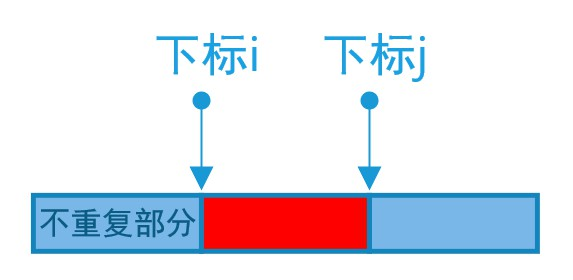

# LeetCode - 题解


## 前言


文献[^1]提出`软件是人脑力的替代,若把软件比拟为人,则开发方法的思维模式可比拟为软件系统的“世界观”和“方法论”`，另外，文章[^2]提出`语言只是实现逻辑的一种工具，核心能力是逻辑本身，...，核心竞能力跟语言其实没有多大的关系`。

从这两篇文章可以得出：**软件开发的关键，不在于语言的具体形式，而是业务应用场景所需的核心技术，背后则是开发的思维逻辑**。前者不同的应用场景有所不同，在抽象层次上，后者都是相通的。

而一切软件开发的基础，都是**算法与数据结构**：`程序=算法+数据结构`，因此，有必要时刻保持对`算法与数据结构`的练习和理解，这需要有一个合适的环境进行练习（刷题）。

有目标和有策略地练习，可以有效地提升效率、增强印象、加深理解、增加记忆的持久性。为此，按照文章[^3]介绍的方法策略，在[LeetCode](https://leetcode.com/problemset/algorithms/)上进行刷题，部分题解和动图参考引用自leetcode题解[^4]和LeetCodeAnimation[^5]。

## 数组

### 1.[Two Sum](https://leetcode.com/problems/two-sum)

> Given an array of integers, return **indices** of the two numbers such that they add up to a specific target. You may assume that each input would have ***exactly*** one solution, and you may not use the *same* element twice.

**Example：**

> Given nums = [2, 7, 11, 15], target = 9,
>
> Because nums[**0**] + nums[**1**] = 2 + 7 = 9,
> return [**0**, **1**].

**理解和思路：**

1. 如何确定两个数？

   先确定第一个数，这个数必须小于目标数，假设第一个数是 num[i]，然后计算出剩下数的值 number = target - nums[i]，从数组中找到number；如果没有number，说明第一个数无效，再换下一个数，一共需要两次嵌套循环，时间复杂度为：$O(n^2) $。

2. 使用HashMap进行查找

   上述过程使用了两次对数组的遍历，第二次遍历的目的是在数组中对某个特定值number进行搜索，问题变成了一个**查找问题**。使用更加高效的Hash查找，把数组先转换成Map，再进行搜索。

   > 第一步，从下标$i$处开始遍历数组，计算出它对应的组合值：number = target - nums[i]；
   >
   > 第二步，判断map中是否有number，如果有就返回两者的坐标；
   >
   > 第三步，如果没有number，就把当前值nums[i]和下标$i$添加进map中；

   只进行了一次遍历，时间复杂度：$O(n)$。

**代码实现：**

```java
public static int[] twoSum(int[] nums, int target) {
    if (nums == null || nums.length == 0) {
        return null;
    }
    Map<Integer, Integer> map = new HashMap<>();
    int number = 0;
    for (int i = 0; i < nums.length; i++) {
        number = target - nums[i];
        if (map.containsKey(number) && map.get(number) != i) {
            return new int[]{map.get(number), i};
        }
        map.put(nums[i], i);
    }
    return null;
}
```

### 11.[Container With Most Water](https://leetcode.com/problems/container-with-most-water)

> Given *n* non-negative integers *a1*, *a2*, ..., *an* , where each represents a point at coordinate (*i*, *ai*). *n* vertical lines are drawn such that the two endpoints of line *i* is at (*i*, *ai*) and (*i*, 0). Find two lines, which together with x-axis forms a container, such that the container contains the most water.
>
> **Note:** You may not slant the container and *n* is at least 2.


**Example：**

> **Input**: [1,8,6,2,5,4,8,3,7]
> **Output**: 49
>
> **Explanation:** 
>
> The above vertical lines are represented by array [1,8,6,2,5,4,8,3,7]. In this case, the max area of water (blue section) the container can contain is 49.

**理解和思路：**

1. 水的容积与3个变量有关：左边的高、右边的高、两者的下标距离，要求水的容积最大，也就是求两边的高度和X轴组成的矩形面积；
2. 创建两个指针 left 和 right，分表表示左边的坐标和右边的坐标，计算出初始面积：从nums[left] 和 nums[right]中选择出较小值最为 height，面积为 area = height * (right - left)；
3. $left$从左向右遍历，$right$从右向左遍历，因为两者的距离 (right - left) 在变小，所以只有当遍历到的值大于height时才会停止，计算新的面积，更新最大面积，直到left == right
4. 时间复杂度$O(n)$，空间复杂度$O(1)$。

**代码实现：**

```java
public static int maxArea(int[] nums) {
	int left = 0, right = nums.length - 1;
  int height = Math.min(nums[left], nums[right]);
  int area = (right - left) * height;
  while (left < right) {
  	while (nums[left] <= height && left < nums.length - 1) {
  		left++;
    }
    while (nums[right] <= height && right > 0) {
    	right--;
    }
    height = Math.min(nums[left], nums[right]);
    area = Math.max(area, (right - left) * height);
  }
	return area;
}
```

### 15.[3Sum](https://leetcode.com/problems/3sum)

> Given an array nums of *n* integers, are there elements *a*, *b*, *c* in nums such that *a* + *b* + *c* = 0? Find all unique triplets in the array which gives the sum of zero.
>
> **Note:**The solution set must not contain duplicate triplets.
>
> **Example:**
>
> Given array nums = [-1, 0, 1, 2, -1, -4],
>
> A solution set is:
>  [
>    [-1, 0, 1],
>    [-1, -1, 2]
>  ]

**理解和思路：**

1. 确定3个数满足：A+B+C=0，如果先确定了A，就变成了在剩下的集合中求解：B+C=-A，等价于[第一题](# 1.[Two Sum](https://leetcode.com/problems/two-sum))；
2. 额外要求是，不能出现重复的结果集合，这就要求在确定第一个数A之后，不能出现重复，否则[B，C]的结果集一定会出现重复，为了实现这一目标，需要先把数组排序。
3. 时间复杂度$O(n^2)$

**代码实现：**

```java
public List<List<Integer>> threeSum(int[] nums) {
	List<List<Integer>> result = new ArrayList<>();
	Arrays.sort(nums); // 升序排列

	int target; // 第一个数A的相反数
	int j; // 第二个数B的下标
	int k; // 第三个数C的下标，k从后向前遍历，这样只需要一次遍历就可以完成对剩下所有数据的遍历
	for (int i = 0; i < nums.length; i++) {
		if (i > 0 && nums[i] == nums[i - 1]) {
			continue;
		}
		target = -nums[i];
		j = i + 1;
		k = nums.length - 1;
		while (j < k) {
			if (nums[j] + nums[k] == target) {
				List<Integer> list = new ArrayList<>(3);
				list.add(nums[i]);
				list.add(nums[j]);
				list.add(nums[k]);
				result.add(list);
				j++;
				k--;
				// 为了避免B和C的重复
				while (j < k && nums[j] == nums[j - 1]) {
					j++;
				}
				while (j < k && nums[k] == nums[k + 1]) {
					k--;
				}
			} else if (nums[j] + nums[k] < target) {
				// 因为数组已经排好序了，如果两个数的和小于目标值，就增加j的值
				j++;
			} else {
				// 如果两个数的和大于目标值，就减小K的值
				k--;
			}
		}
	}
	return result;
}
```

**误区：**

在求解这一题时，当时进入了一个误区：竟然数组是有序的，那么在求解第3个数的时候可以使用二分查找，应该比上面那种方法的遍历更加高效，代码如下：

```JAVA
public List<List<Integer>> threeSum(int[] nums) {
	List<List<Integer>> result = new ArrayList<>();
	if (nums == null || nums.length == 0) {
		return result;
	}
	Arrays.sort(nums); // 升序排列

	int target;
	int i; // 第一个数的下标
	int j; // 第二个数B的下标
	int k; // 第三个数C的下标
	for (i = 0; i < nums.length; i++) {
		if (i > 0 && nums[i] == nums[i - 1]) {
			continue;
		}
		j = i + 1;
		while (j < nums.length) {
			int[] subNums = new int[nums.length - j - 1];
			target = -(nums[i] + nums[j]);
			k = binarySearch(nums, j + 1, nums.length, target);
			if (k >j) {
				List<Integer> list = new ArrayList<>(3);
				list.add(nums[i]);
				list.add(nums[j]);
				list.add(nums[k]);
				result.add(list);
			}
			j++;
			while (j < nums.length && nums[j] == nums[j - 1]) {
				j++;
			}
		}
	}
	return result;
}

// 二分查找
private int binarySearch(int[] a, int i, int j, int key) {
	int low = i;
	int high = j - 1;

	while (low <= high) {
		int mid = (low + high) >>> 1;
		int midVal = a[mid];

		if (midVal < key)
			low = mid + 1;
		else if (midVal > key)
			high = mid - 1;
		else
			return mid; // key found
	}
	return -(low + 1);  // key not found.
}
```

提交后发现，结果不如第一种方法，结果对别如下：


后来仔细想了一下才发现原因：方法1在内部循环的时候，可以同时确定2个数B和C，复杂度是$O(n^2)$，而方法2需要先确定B，再使用二分查找确定C，复杂度是$o(n^2*logn)$，所以效率比方法1更低。

### 16.[3Sum Closest](https://leetcode.com/problems/3sum-closest)

> Given an array `nums` of *n* integers and an integer `target`, find three integers in `nums` such that the sum is closest to `target`. Return the sum of the three integers. You may assume that each input would have exactly one solution.

**Example:**

```java
Given array nums = [-1, 2, 1, -4], and target = 1.
The sum that is closest to the target is 2. (-1 + 2 + 1 = 2).
```

**理解和思路:**

1. 从前面第1、15题不同的是，求最接近目标值的三个数，并返回它们的和值。
2. 解法与[题15](# 15.[3Sum](https://leetcode.com/problems/3sum))相似，但是与它不同的是，第二个数和第三个数允许重复。

**代码实现:**

```java
public int threeSumClosest(int[] nums, int target) {
	int result = 0;
	if (nums == null || nums.length == 0) {
		return result;
	}
	if (nums.length <= 3) {
		return nums[0] + nums[1] + nums[2];
	}
	Arrays.sort(nums);
	result = nums[0] + nums[1] + nums[nums.length - 1]; // 随机选择3个数求和作为初始值
	int i = 0;
	int j;
	int k;
	int sum;
	for (; i < nums.length - 2; i++) {
		if (i > 0 && nums[i - 1] == nums[i])
			continue;
		j = i + 1;
		k = nums.length - 1;
		while (j < k) {
			sum = nums[i] + nums[j] + nums[k];
			if (sum == target) {
				return sum;
			} else if (sum < target) {
				j++;
			} else {
				k--;
			}
			// 更新result的值
			result = Math.abs(sum - target) < Math.abs(target - result) ? sum : result;
		}
	}
	return result;
}
```

### 18.[4Sum](https://leetcode.com/problems/4sum)

> Given an array `nums` of *n* integers and an integer `target`, are there elements *a*, *b*, *c*, and *d* in `nums` such that *a* + *b* + *c* + *d* = `target`? Find all unique quadruplets in the array which gives the sum of `target`.
>
> **Note:**
>
> The solution set must not contain duplicate quadruplets.

**Example:**

```java
Given array nums = [1, 0, -1, 0, -2, 2], and target = 0.

A solution set is:
[
  [-1,  0, 0, 1],
  [-2, -1, 1, 2],
  [-2,  0, 0, 2]
]
```

**理解和思路:**

1. 求4个数的和，令它们的和值等于目标值，求出所有不重复的解，与[题15](# 15.[3Sum](https://leetcode.com/problems/3sum))最大的区别在于，多了一个数；
2. 基本思路：从4Sum --> 3Sum --> 2Sum，在每一次向下求解时，注意结束运行的特殊情况和更新目标值。

```java
public List<List<Integer>> fourSum(int[] nums, int target) {
	List<List<Integer>> result = new ArrayList<>();
	if (nums == null || nums.length < 4) {
		return result;
	}
	int len = nums.length;
	Arrays.sort(nums);
	for (int i = 0; i < len - 3; i++) {
		// 如果最小的4个数和大于目标数或者最大的4个数和小于目标数，结束运行
		if (nums[i] + nums[i + 1] + nums[i + 2] + nums[i + 3] > target
				|| nums[len - 1] + nums[len - 2] + nums[len - 3] + nums[len - 4] < target) {
			break;
		}
		// 如果当前数与最大的3个数之和小于目标值，则跳过
		if (nums[i] + nums[len - 1] + nums[len - 2] + nums[len - 3] < target) {
			continue;
		}
		// 避免重复值
		if (i > 0 && nums[i] == nums[i - 1]) {
			continue;
		}
		// 指定第一个数，计算第二个目标数
		int target2 = target - nums[i];
		for (int j = i + 1; j < len - 2; j++) {
			// 在第二层遍历中，同样要进行第一轮类似的判断
			if (nums[j] + nums[j + 1] + nums[j + 2] > target2
					|| nums[len - 1] + nums[len - 2] + nums[len - 3] < target2) {
				break;
			}
			if (nums[j] + nums[len - 1] + nums[len - 2] < target2) {
				continue;
			}
			if (j > i + 1 && nums[j] == nums[j - 1]) {
				continue;
			}
			// 指定第二个数，计算第三个目标数
			int target3 = target2 - nums[j];
			// 在剩下的数中，寻找和为target3的两个数
			int left = j + 1, right = len - 1;
			while (left < right) {
				int sum = nums[left] + nums[right];
				if (sum == target3) {
					// 如果和等于目标3，那么把所有数都添加进列表中
					result.add(Arrays.asList(nums[i], nums[j], nums[left], nums[right]));
					// 避免left和right的数重复
					while (left < right && nums[left] == nums[left + 1]) {
						left++;
					}
					while (left < right && nums[right] == nums[right - 1]) {
						right--;
					}
					left++;
					right--;
				} else if (sum < target3) {
					left++;
				} else {
					right--;
				}
			}
		}
	}
	return result;
}
```

### 26.[Remove Duplicates from Sorted Array](https://leetcode.com/problems/remove-duplicates-from-sorted-array)

> Given a sorted array *nums*, remove the duplicates [**in-place**](https://en.wikipedia.org/wiki/In-place_algorithm) such that each element appear only *once* and return the new length.
>
> Do not allocate extra space for another array, you must do this by **modifying the input array in-place** with O(1) extra memory.

**Example 1:**

```vim
Given nums = [1,1,2],

Your function should return length = 2, with the first two elements of nums being 1 and 2 respectively.It doesn't matter what you leave beyond the returned length.
```

**Example 2:**

```vim
Given nums = [0,0,1,1,1,2,2,3,3,4],
Your function should return length = 5, with the first five elements of nums being modified to 0, 1, 2, 3, and 4 respectively.
It doesn't matter what values are set beyond the returned length.
```

**理解和思路：**

1. 从一个有序数组中移除重复的元素，返回移除后的数组长度，不允许使用额外的空间，只能在传入的数组上做操作，不用在意最后数组中剩下的元素；

2. 要移除重复的元素，需要两个下标指针$i,j$，如下图所示：

   
   
   下标$i$及其前面部分由数组中不重复的元素组成，下标$nums[i,..,j]$部分是与下标$i$处元素值相同的元素，下标$j$指向的当前遍历到的元素；
   
3. 如果下标$j$处的值与下标$i$处的值不等，就把下标$j$的值复制到下标$i+1$处，然后下标$i$和下标$j$分别向后移动一位，动图展示的过程如下[^5]：

   

**代码实现：**

```java
public int removeDuplicates(int[] nums) {
	if (nums == null) {
		return 0;
	}
	if (nums.length < 2) {
		return nums.length;
	}
	int i = 0;
	int j = 1;
	for (; j < nums.length; j++) {
		if (nums[j] == nums[j - 1]) {
			continue;
		}
		nums[++i] = nums[j];
	}
	return i + 1;
}
```

### 27.[Remove Element](https://leetcode.com/problems/remove-element)

> Given an array *nums* and a value *val*, remove all instances of that value [**in-place**](https://en.wikipedia.org/wiki/In-place_algorithm) and return the new length.
>
> Do not allocate extra space for another array, you must do this by **modifying the input array** [**in-place**](https://en.wikipedia.org/wiki/In-place_algorithm) with O(1) extra memory.
>
> The order of elements can be changed. It doesn't matter what you leave beyond the new length.

**Example 1:**

```
Given nums = [3,2,2,3], val = 3,
Your function should return length = 2, with the first two elements of nums being 2.
It doesn't matter what you leave beyond the returned length.
```

**Example 2:**

```
Given nums = [0,1,2,2,3,0,4,2], val = 2,
Your function should return length = 5, with the first five elements of nums containing 0, 1, 3, 0, and 4.
Note that the order of those five elements can be arbitrary.
It doesn't matter what values are set beyond the returned length.
```

**理解与思路：**

1. 给一个数组nums 和数值val，要求从数组中去除和val相同的元素，返回最后数组的长度newLength,，且要求nums[0,...,newLenth-1]的范围内没有与val相等的元素。
2. 和[题26](# 26.[Remove Duplicates from Sorted Array](https://leetcode.com/problems/remove-duplicates-from-sorted-array))相似，要使用两个下标，分别表示有效的数组范围和正在遍历的数组下标。

**代码实现：**

```java
public int removeElement(int[] nums, int val) {
	int i = 0;
	int j = 1;
	while (i < nums.length) {
		if (nums[j] != val) {
			nums[i++] = nums[j];
		}
	}
	return i;
}
```

### 31.[Next Permutation](https://leetcode.com/problems/next-permutation)

> Implement next permutation, which rearranges numbers into the lexicographically next greater permutation of numbers.
>
> If such arrangement is not possible, it must rearrange it as the lowest possible order (ie, sorted in ascending order).The replacement must be in-place, do not allocate extra memory.
>
> Here are some examples. Inputs are in the left-hand column and its corresponding outputs are in the right-hand column.
>
> 1,2,3  →  1,3,2
>
> 3,2,1  →  1,2,3
>
> 1,1,5  →  1,5,1

**理解和思路：**

1. 输入一个数组序列，返回它在字典序列中的下一个序列，如果没有，就返回字典序中的第一个序列，不能使用额外的空间。
2. 


<p style="color: rgb(0, 204, 204); text-align: right;">
  <a href="#LeetCode - 题解">top⬆</a>
</p>


## 2.Add Two Numbers

You are given two **non-empty** linked lists representing two non-negative integers. The digits are stored in **reverse order** and each of their nodes contain a single digit. Add the two numbers and return it as a linked list.

You may assume the two numbers do not contain any leading zero, except the number 0 itself.

**Example:**

**Input:** (2 -> 4 -> 3) + (5 -> 6 -> 4)
 **Output:** 7 -> 0 -> 8
 **Explanation:** 342 + 465 = 807.

**理解和思路**

1. 链表的第一位值都是个位上的数，所以同时遍历两个链表，把相同位上的值相加；
2. 如果两个数相加有进位，该位置上保存的是和值对10的余数，进位的1则是加到下一个位置上；
3. 创建一个链表，用来保存余值，最后返回该链表的头指针。

**代码**

```java
public ListNode addTwoNumbers(ListNode l1, ListNode l2) {
    if (l1 == null)
        return l2;
    if (l2 == null)
        return l1;
    int current = 0;
    ListNode result = new ListNode(0);
    ListNode pointer = result;

    while (l1 != null || l2 != null || current > 0) {
        if (l1 != null) {
            current += l1.val;
            l1 = l1.next;
        }
        if (l2 != null) {
            current += l2.val;
            l2 = l2.next;
        }
        result.val = current % 10;
        current /= 10;
        if (l1 != null || l2 != null || current > 0) {
            result.next = new ListNode(0);
            result = result.next;
        }
    }
    return pointer;
}
```

<p style="color: rgb(0, 204, 204); text-align: right;">
    <a href="#LeetCode - 题解">top⬆</a>
</p>

------

## 3. Longest Substring Without Repeating Characters

Given a string, find the length of the **longest substring** without repeating characters.

| **Example 1:**                                               | **Example 2:**                                               | **Example   3:**                                             |
| ------------------------------------------------------------ | ------------------------------------------------------------ | ------------------------------------------------------------ |
| **Input:**   "abcabcbb"                                      | **Input:**   "bbbbb"                                         | **Input:**   "pwwkew"                                        |
| **Output:**   3                                              | **Output:**   1                                              | **Output:**   3                                              |
| **Explanation:** The answer is "abc", which the   length is 3. | **Explanation:**   The answer is "b", with   the length of 1. | **Explanation:**   The answer is "wke",   with the length of 3. |

**理解和思路：**

1. 如果字符串的最大无重复字串的下标是：$[i,...,j]$，那么字串的长度是：$j-i+1$，这说明，$[i,...,j]$中某个字符在$[0,...,i-1]$范围内出现过；
2. 假设这个字符是$S_k$，那么该字符同时在两个范围内出现时，就选择下标比较大的那一个，作为无重复字串中的有效字符；
3. 那是不是选择最大的那一个下标呢？不是，而是要选择小于$i$的最大的那一个下标，$i$是当前临时确定的子串的起始下标。

**代码实现：**

```java
public int lengthOfLongestSubstring(String s) {
    int ans = 0;
    int i = 0;
    Map<Character, Integer> map = new HashMap<>();
    for (int j = 0; j < s.length(); j++) {
        char ch = s.charAt(j);
        if (map.containsKey(ch)) {
            i = Math.max(map.get(ch), i);
        }
        ans = Math.max(ans, j - i + 1);
        map.put(ch, j + 1);
    }
    return ans;
}
```

# 

 


<p style="color: rgb(0, 204, 204); text-align: right;">
    <a href="#LeetCode - 题解">top⬆</a>
</p>


## 数据结构与算法分析

### 数据结构


### 算法分析

#### 全排列与字典序算法

输入n个不同的元素，所有元素组成的所有序列集合就是全排列，比如输入[1,2,3]，全排列为：

>  [1,2,3]，[1,3,2]，[2,1,3]，[2,3,1]，[3,1,2]，[3,2,1]

常用的实现算法有递归法和字典序算法。

1. **递归全排列**

   给定n个元素，其全排列的递归过程可以描述如下：

   ① 任意取一个元素放在第一个位置；

   ② 对剩下的n-1个元素进行全排列，可以看作是对n-1个元素进行全排列；

   ③ 重复2步，直到最后只剩下一个元素；

   ④ 重复1,2,3步，直到所有元素都在第一个位置放置过，全排列结束。

   以数组[1,2,3]为例，其全排列的递归过程如下：

   ① 取1放在第一个位置，后面连接着（2,3）的全排列：

   - （2,3）的全排列：

     取2放在第一位，只剩下3，形成序列：[1,2,3]

     取3放在第一位，只剩下2，形成序列：[1,3,2]

   ② 取2放在第一个位置，后面连接着（1,3）的全排列：

   * （1,3）的全排列：

     取1放在第一位，只剩下3，形成序列：[2,1,3]

     取3放在第一位，只剩下1，形成序列：[2,3,1]

   ③ 取3放在第一个位置，后面连接着（1,2）的全排列：

   * （1,2）的全排列：

     取1放在第一位，只剩下2，形成序列：[3,1,2]

     取2放在第一位，只剩下1，形成序列：[3,2,1]

   **代码实现：**

   ```java
   
   ```

   

2. 

3. 哈哈


<p style="color: rgb(0, 204, 204); text-align: right;">
<a href="#LeetCode - 题解">top⬆</a>
</p>


# 附录

## Z.参考文献

[^1]: [软件开发方法发展回顾与展望](http://www.jos.org.cn/jos/ch/reader/view_abstract.aspx?flag=1&file_no=5650&journal_id=jos)
[^2]: [写给期待年薪百万的IT同学](https://mp.weixin.qq.com/s/KKFH_avd8vdtTcvQTAD-lg)

[^3]: [如何全方位的准备数据结构和算法？](https://mp.weixin.qq.com/s/6BuXwpEwCy85jYGKlRpOGA)
[^4]: [leetcode题解](https://github.com/azl397985856/leetcode)
[^5]: [LeetCodeAnimation](https://github.com/MisterBooo/LeetCodeAnimation)


<p style="color: rgb(0, 204, 204); text-align: right;">
    <a href="#LeetCode - 题解">top⬆</a>
</p>
